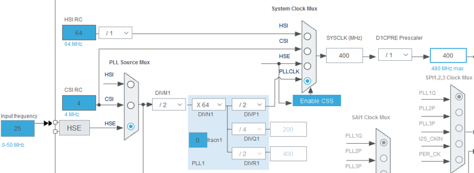
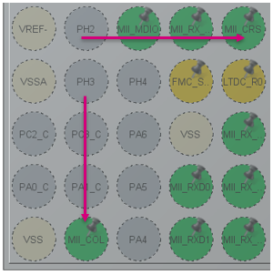
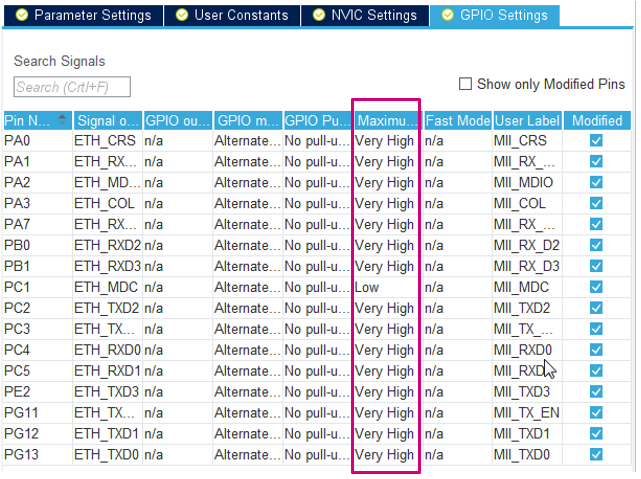
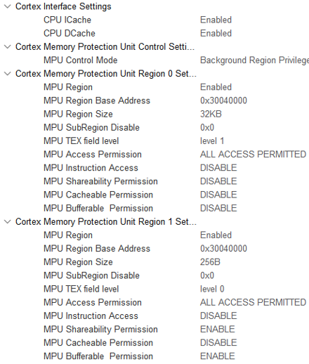
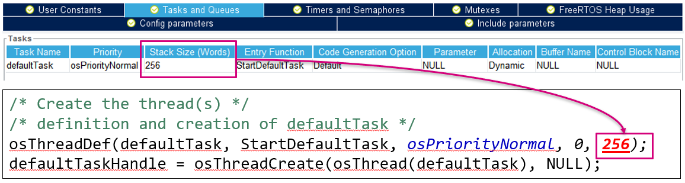
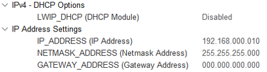
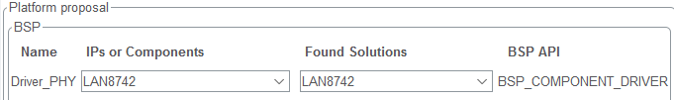
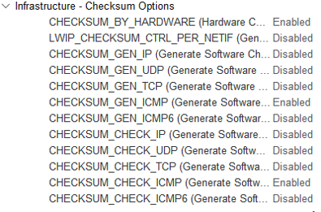
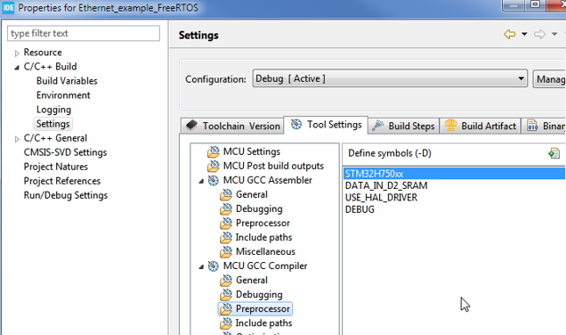

# STM32H7 STM32CubeMX based Ethernet examples

*This readme is intended for STM32CubeIDE version 1.6.1 and STM32CubeH7 version 1.9.0*

Simple Ethernet examples based on LwIP and FreeRTOS, running on ST Nucleo and Discovery boards.
These examples are provided to accompany the [FAQ article on ST community][faq].
The same how to step-by-step is also provided [below](#how-to-create-project-from-scratch)

## Features
* Fixed IP address 192.168.1.10
* Code should work even when re-generating the code in STM32CubeMX

## Release notes

| Version | STM32CubeIDE version | STM32CubeH7 version | Description / Update | Date |
|--:|--:|--:|--|--:|
| 1.0 | 1.6.1 | 1.9.0 | Initial release on ST community (with minor changes on Github) | June 21<sup>st</sup> 2021 |

Using GIT tags it should be easy to find examples for particular version of STM32CubeIDE and HAL library

## License

Libraries and middleware is taken from [STM32CubeH7 package][cubeh7]. So the same licenses apply to the these examples. There is minimum code added on top of STM32CubeMX and HAL libraries, this code is provided AS-IS.

# How to create project from scratch

## Goal

Goal of this example is to:
* Configure project in STM32CubeMX for STM32H750-Discovery
* Configure FreeRTOS and LwIP middlewares correctly
* Send UDP message periodically (optional)

Although the example is using STM32H750-Discovery, it might be easy to use the same steps for other STM32H7 based boards. The main differences are usually pinout and clock configuration. You might also need to check board solder bridges to make sure the Ethernet is connected to MCU.

## STM32CubeMX project configuration

* Create new project in STM32CubeMX, select STM32H750-Discovery board and select "No" to "Initialize all peripherals in default mode?" pop-up.
	* This will help with pin assignment.

## Basic configuration

Configure clock tree:
* In pinout/RCC configure HSE in bypass mode
* In clock tree configure 400MHz for core



* In pinout/SYS configure different timebase than SysTick (recommended when using FreeRTOS)
	* TIM6 is usually a good option, since it is a simple timer

## Ethernet configuration

* Enable Ethernet peripheral in pinout view in MII mode (MII used on the board).
* Enable Ethernet interrupt and set preemption priority to 5. This is required by FreeRTOS in order to call its functions from interrupt handler.
* Relocate Ethernet CRS and COL signals from PH2/PH3 to PA0/PA3
	* These signals are optional in full-duplex mode and not connected in default configuration
	* This will also allow use PH2/PH3 for QSPI
* Other pins should be correctly placed, since we create the project from board selector.



* Set GPIO pin speed to Very High.


​

_The ETH_MDC speed couldn't be changed for some reason, but it doesn't affect the application and it was already fixed in new versions._

## Cortex-M7 configuration

* Enable ICache and DCache.
* Enable memory protection unit (MPU) in “Background Region Privileged access only + MPU Disabled ...” mode. Configure regions according to the picture below:



## FreeRTOS configuration

* Enable the FreeRTOS with CMSIS_V1 API.
* Increase the size of defaultTask stack to 256 words
* Lower stack values cause memory corruptions
* Please check also that the generated code is correct, since there is bug when increasing the MINIMAL_STACK_SIZE and there might be old value in code (this should be fixed in new versions)



## LwIP configuration

* Enable LwIP in middleware.
* In "General settings" tab, disable DHCP server and configure fixed IP address (unless you know how to configure and use DHCP).



* In the attached examples, the 192.168.1.10 IP address is used (instead of 192.168.0.10 shown on the screenshot).
* In "Platform settings" tab select "LAN8742" in both select boxes. The LAN8742 driver is also compatible with LAN8740 device, which is actually present on the STM32H750-Discovery board. The main difference between these devices is support of MII interface.



* In "Checksum" tab enable CHECKSUM_BY_HARDWARE. Other options should automatically reconfigure and you can leave them in this state.



In "Key options" tab:
* Configure MEM_SIZE to 16360. This specifies the heap size, which we will relocated to D2 SRAM (16kb minus 24 bytes for allocator metadata).
* Also enable LWIP_NETIF_LINK_CALLBACK (needed for cable plugging/unplugging detection).

## Generate project

Save project to some folder of your selection. Now you can generate the project for IDE. We will use STM32CubeIDE in this example, but it should work with other IDEs.

## Modyfying the code (STM32CubeIDE)
* Add following code to lwipopts.h in user section, which will relocated LwIP heap to D2 SRAM:
```c
/* USER CODE BEGIN 1 */
#define LWIP_RAM_HEAP_POINTER (0x30044000)
/* USER CODE END 1 */
```
* Add DATA_IN_D2_SRAM to macro definitions in project: 



### Modify linkerscript (not valid for Keil/IAR)
This step should be skipped for Keil and IAR, since they support placing variables at specific address in C code.
Modify the linkerscript (*.ld) that the ETH descriptors and buffers are located in D2 SRAM. Also it is recommended to place all RAM to RAM_D1.
In STM32CubeMX generated project, the "_FLASH" suffix linkerscript should be modified, which is used by default (e.g.: STM32H750XBHx_FLASH.ld). The "_RAM" suffix linkerscript is template for executing code from internal RAM memory.
```ld
  } >RAM_D1

  /* Modification start */
  .lwip_sec (NOLOAD) : {
    . = ABSOLUTE(0x30040000);
    *(.RxDecripSection) 
    
    . = ABSOLUTE(0x30040060);
    *(.TxDecripSection)
    
    . = ABSOLUTE(0x30040200);
    *(.RxArraySection) 
  } >RAM_D2
  /* Modification end */

  /* Remove information from the compiler libraries */
  /DISCARD/ :
  {
    libc.a ( * )
    libm.a ( * )
    libgcc.a ( * )
  }
```
The memory definitions at the beginning of the linkerscript should look like:

```ld
MEMORY
{
    FLASH (rx)      : ORIGIN = 0x08000000, LENGTH = 1024K
    DTCMRAM (xrw)      : ORIGIN = 0x20000000, LENGTH = 128K
    RAM_D1 (xrw)      : ORIGIN = 0x24000000, LENGTH = 512K
    RAM_D2 (xrw)      : ORIGIN = 0x30000000, LENGTH = 288K
    RAM_D3 (xrw)      : ORIGIN = 0x38000000, LENGTH = 64K
    ITCMRAM (xrw)      : ORIGIN = 0x00000000, LENGTH = 64K
}
```
### Adding simple Hello UDP message

* Add following include files at the beginning of main.c:
```c
#include “lwip/udp.h”
#include <string.h>
```
* Modify the StartDefaultTask in main.c with the following code:
```c
/* USER CODE BEGIN 5 */
const char* message = "Hello UDP message!\n\r";

osDelay(1000);

ip_addr_t PC_IPADDR;
IP_ADDR4(&PC_IPADDR, 192, 168, 1, 1);

struct udp_pcb* my_udp = udp_new();
udp_connect(my_udp, &PC_IPADDR, 55151);
struct pbuf* udp_buffer = NULL;

/* Infinite loop */
for (;;) {
  osDelay(1000);
  /* !! PBUF_RAM is critical for correct operation !! */
  udp_buffer = pbuf_alloc(PBUF_TRANSPORT, strlen(message), PBUF_RAM);

  if (udp_buffer != NULL) {
    memcpy(udp_buffer->payload, message, strlen(message));
    udp_send(my_udp, udp_buffer);
    pbuf_free(udp_buffer);
  }
}
/* USER CODE END 5 */
```
Now you should be able to ping the device and receive UDP messages, assuming that you configure IP address 192.168.1.1 for the receiving device (the 192.168.1.0/24 network is used by attached examples). On Linux machine you can observe the messages with the following command:
```
netcat –ul 55151
```

### Tips & common mistakes

1. For STM32H72x/H73x devices, the Ethernet buffers can't be placed in address range 0x30040000 - 0x30048000, since that range is not valid. D2 SRAM on those devices is much smaller, so the buffers need to be placed starting at 0x30000000. This affects RX & TX descriptors and RX buffer addresses (ETH configuration in CubeMX) and LWIP_RAM_HEAP_POINTER used for TX buffers (LWIP > Key options in CubeMX).
1. When running the stack on Cortex-M4, the buffers can be placed at the same address (0x30040000), but it is better to place them at 0x10040000 which is alias for the same address. This alias is accessible by Cortex-M4 D-bus and helps to utilize the Harvard architecture.
1. When not using FreeRTOS, the Ethernet interrupt should be disabled and MX_LWIP_Process should be called periodically (in main loop).
1. On STM32H747-Discovery board, modification needs to be done to default solder bridge configuration. SB8 should be closed and SB21 should be open for Ethernet to work, otherwise the MDC signal is not properly connected.

When facing issues with your own project:
1. First try example and see if there is proper configuration on PC side. With corporate firewalls and restrictions, it might be difficult to perform simple ping to specific IP address. In some cases it is easier to test from personal PC, or some PC with firewall disabled.
1. Check if Ethernet interrupt is called and if RX callback is called
	* If not, GPIOs are set to proper speed (very high)
	* and ETH global interrupt is enabled (only for FreeRTOS)
		* Interrupt priority should be 5 - preemption and 0 - subpriority. This is required by default FreeRTOS configuration.
1. If Hardfault is called, the problem might be in MPU configuration
	* Please check carefully (e.g. slight mistake like having "256KB" instead "256B" can make big difference)
1 RX callback is called but ping still not work
	* check that the buffers are properly placed in linkerscript (the one ending with "_FLASH.ld")
	* in STM32CubeIDE you can use "Build analyzer" window
1. When allocating buffers via pbuf_alloc (or similar), PBUF_RAM must be used as 3rd parameter. This is necessary to ensure that the allocated buffer is placed in D2 SRAM and synchronized with DMA
1. Not sufficient stack size for different thread can cause issues.
	* Enabling [stack overflow detection][freertos_stack] can help identify where is the problem

[freertos_stack]: https://www.freertos.org/Stacks-and-stack-overflow-checking.html
[cubeh7]: https://github.com/STMicroelectronics/STM32CubeH7
[iperf]: https://iperf.fr/
[faq]: https://community.st.com/s/article/How-to-create-project-for-STM32H7-with-Ethernet-and-LwIP-stack-working